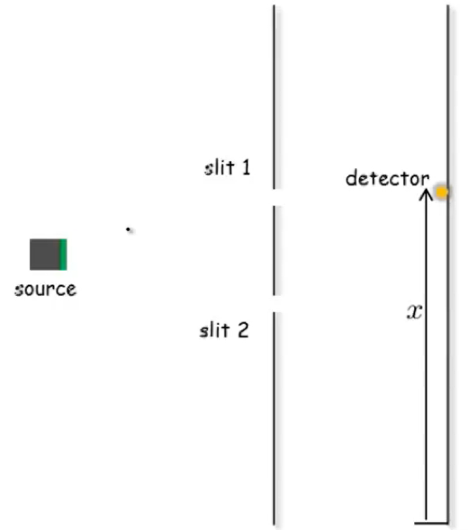
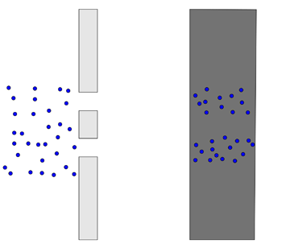
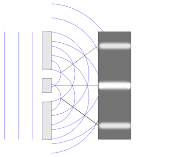
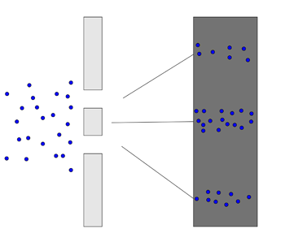
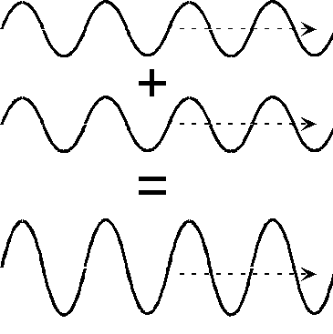
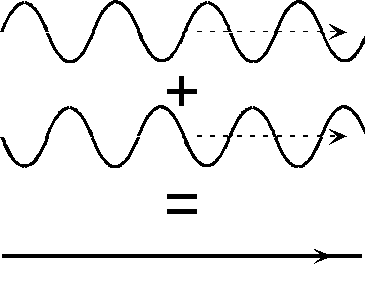

# Double-slit experiment

- Is a demonstration that light and matter can characteristics of both classically defined waves and particle. It displays the fundamentally probabilistic nature of quantum mechanical phenomena.
- The experiment is performed as demonstrated below: using a source of light, could be a laser beam, is passing through the slits. The light is then observed on the plate behind the slits.
  

# Particles

We would expect a pattern roughly the same size as the slits.
Using particles as the source we will get the following pattern:

# Light of a single wavelength

Shining light at the two slits will generate the following pattern. The blue lines represent the peaks of the waves. As the wave passes though both slits, it essentially splits into two new waves, each spreading out from one of the slits. These two waves then interfere with each other. At some points, where a peak meets a trough, they will cancel each other out. The stripes on the back plate resembles an interference pattern.

# Electrons

Image firing electrons through the slits you would expect the following pattern:

However, as we discovered that's not the case. As shown on the double-slit image, you could place a detector on the plate behind the slits, and measure which slits the electrons go through.
This is where it gets weird. The act of trying to measure which slit the electrons go through, the interference pattern disappear. This suggests that electrons share the same characteristics of particles and waves.

# Interference

Happens when one or more waves/particles are sent from the same source, or when they have the same or almost the same frequency.
Interference effects can be observed with all types of waves for example light, radio, acoustic, surface water waves, gravity waves, or matter waves.

## Constructive Interference

In the figure above we can see two waves with the same frequency traveling in the same direction.
If we add the two waves together point for point they will generate a wave that looks almost identical to the first, but its amplitude is larger.

When the resulting wave is larger than the original waves its called constructive interference.

## Destructive Interference

Again, we have two waves with the same frequency traveling in the same direction.
If we try to add these two together when the first wave is up and the second is down, the two add to zero. When the first wave is down and the second is up, they again add to zero. This means that all points of the waves cancels out each other out. The sum of the waves can either be lower than either wave, alone or even zero. This is called destructive interference.
